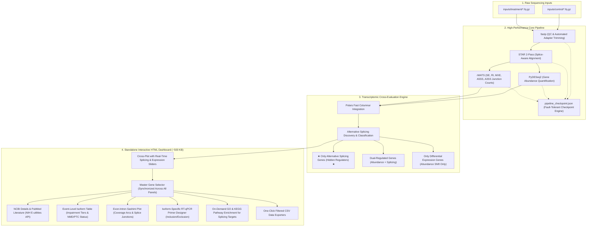

# GenSplice-Agent 🧬

> **Automated RNA-Seq Alternative Splicing Discovery Platform: Pinpointing Hidden Splicing-Driven Regulators with Standalone Interactive Reporting**

[](LICENSE)
[](https://www.python.org/downloads/)
[]()
[-brightgreen.svg)]()

`GenSplice-Agent` is an automated computational transcriptomics platform designed specifically to **discover and validate hidden Alternative Splicing (AS) events** that traditional Differential Expression (DEG) pipelines completely miss.

While conventional RNA-seq analyses focus solely on total mRNA quantity ($\text{Log}_2\text{FC}$), critical biological switches frequently occur through **qualitative isoform shifts** ($\Delta\text{PSI}$) without altering total gene expression. `GenSplice-Agent` pinpoints these splicing-driven master regulators, maps their functional consequences (Nonsense-Mediated Decay, reading frame shifts), and auto-designs isoform-specific RT-qPCR primers for laboratory bench validation.

It operates entirely locally with **zero cloud/server dependency**, auto-resumes interrupted runs via fault-tolerant checkpoints, and generates an ultra-lightweight, self-contained interactive HTML dashboard (`gensplice_report.html`, ~500 KB).

---

## 🧭 End-to-End Workflow Architecture



---

## 1. Overview & Alternative Splicing Discovery (GenSplice 소개)

### 🎯 The Blind Spot of Standard RNA-Seq Analysis
Standard RNA-seq pipelines evaluate only total transcript abundance (Differential Expression Analysis, DEG). However, in biological systems, many master regulators exert their physiological control not by changing total mRNA quantity, but by **switching between functional and non-functional isoforms**:
- An alternative exon can be included or skipped, altering critical protein-protein interaction domains or enzymatic active sites.
- An intron can be retained or a frameshift can be introduced, generating a Premature Termination Codon (PTC) that triggers **Nonsense-Mediated Decay (NMD)**.
- **Because total transcript counts remain unchanged, conventional DEG pipelines treat these genes as invariant and completely overlook them.**

### 🔍 How GenSplice-Agent Uncovers Splicing Regulators
`GenSplice-Agent` cross-evaluates quantitative expression changes ($\text{Log}_2\text{FC}$) against qualitative splicing inclusion indices ($\Delta\text{PSI}$):

```text
                     ▲ Alternative Splicing Change (|ΔPSI|)
                     │
       ★ Only Alternative Splicing Genes ★  │   Dual-Regulated Genes
     (Abundance Invariant, Isoform Switched)│ (Both Abundance and Isoform Shifted)
        ★ Missed by Standard DEG! ★         │
─────────────────────┼─────────────────────▶ Differential Expression (|Log2FC|)
       Homeostatic Background Genes         │   Only Differential Expression Genes
         (Baseline, Unchanged)              │  (Abundance Changed, Isoform Unchanged)
                     │
```

### Transcriptomic Classification Categories:
1. **★ Only Alternative Splicing Genes (Hidden Master Regulators) ★**:
   - **Characteristics**: Splicing changes significantly ($|\Delta\text{PSI}| \ge \text{Cutoff}$), but total gene expression remains steady ($|\text{Log}_2\text{FC}| < \text{Cutoff}$).
   - **Significance**: These are prime regulatory candidates operating through qualitative isoform switching. **GenSplice is tailored specifically to discover, visualize, and design validation primers for these genes.**
2. **Dual-Regulated Genes (Expression + Alternative Splicing)**:
   - **Characteristics**: Undergo both transcriptional abundance shifts ($|\text{Log}_2\text{FC}| \ge \text{Cutoff}$) and alternative splicing alterations ($|\Delta\text{PSI}| \ge \text{Cutoff}$).
   - **Significance**: Represents coordinated transcriptional and post-transcriptional reprogramming, where splicing alters protein function alongside quantity changes.
3. **Only Differential Expression Genes (Abundance Shift Only)**:
   - **Characteristics**: Significant expression changes ($|\text{Log}_2\text{FC}| \ge \text{Cutoff}$) without detectable alternative splicing variations ($|\Delta\text{PSI}| < \text{Cutoff}$).
   - **Significance**: Classic DEG targets whose primary mode of regulation is transcriptional upregulation or downregulation.
4. **Homeostatic Background Genes (Baseline Invariant)**:
   - Unchanged in both expression abundance and splicing. Excluded from plot canvas traces to optimize browser performance and maintain an ultra-compact report size (~500 KB).

---

## 2. Installation (install)

`GenSplice-Agent` provides an automated one-click installation script that configures the entire Conda / Bioconda environment and validates all bioinformatics tools.

```bash
./install
```

### What `./install` Automatically Configures:
- **Bioinformatics CLI Engines**: `fastp` (read QC & trimming), `STAR` (splice-aware aligner), `rmats` (alternative splicing quantitation), `subread` (`featureCounts` read summarization), `R` (r-base runtime).
- **High-Performance Python Stack**: `polars` (fast columnar processing), `pydeseq2` (DESeq2 GLM modeling), `plotly` (interactive web graphics), `gseapy` (Enrichr API wrapper), `pandas`, `numpy`, `scipy`.
- **Hardware Auto-Tuning**: Automatically detects CPU threads and available system RAM, setting memory-safe parameters for STAR genome indexing and rMATS multithreading.

### Quick Benchmark Verification
To confirm that your environment, alignment engine, splicing quantitation, and interactive report generator are fully functional, run the bundled benchmark test (GSE52778 Dexamethasone model) in under 60 seconds:
```bash
./test
```

---

## 3. Input Data Guidelines & Rules (input 넣기 및 법칙)

Place your raw sequencing FASTQ files into the `inputs/` directory divided into `control/` and `treatment/`:

```text
inputs/
├── control/
│   ├── control_rep1_1.fq.gz
│   ├── control_rep1_2.fq.gz
│   ├── control_rep2_1.fq.gz
│   └── control_rep2_2.fq.gz
└── treatment/
    ├── treat_rep1_1.fq.gz
    ├── treat_rep1_2.fq.gz
    ├── treat_rep2_1.fq.gz
    └── treat_rep2_2.fq.gz
```

### Naming Conventions & Rules
1. **Supported File Formats**:
   - Gzip-compressed FASTQ (strongly recommended): `.fq.gz`, `.fastq.gz`
   - Uncompressed FASTQ: `.fq`, `.fastq`
2. **Paired-End Suffix Conventions**:
   Read pairs are automatically recognized and paired using standard suffixes:
   - Standard format: `*_1.fq.gz` / `*_2.fq.gz` or `*_1.fastq.gz` / `*_2.fastq.gz`
   - Illumina format: `*_R1.fastq.gz` / `*_R2.fastq.gz` or `*_R1_001.fastq.gz` / `*_R2_001.fastq.gz`
3. **Single-End Support**:
   Single files without pair suffixes (e.g., `sampleA.fq.gz`) are automatically detected as single-end reads, and downstream STAR/rMATS execution flags adjust automatically.
4. **Data Integrity Verification**:
   The pipeline performs gzip block and EOF integrity checks before launching compute-heavy steps, preventing unexpected aborts due to truncated files.

---

## 4. Reference Genome Setup (ref 다운로드)

Set up your organism's reference genome (FASTA sequence, GTF annotations, and STAR splice-junction index) with a single interactive command:

```bash
./ref
```

### Supported Organisms
Running `./ref` displays an interactive menu supporting automated download, coordinate verification, and index construction across major research models:
- **Mammals**: Human (*Homo sapiens* GRCh38), Mouse (*Mus musculus* GRCm39), Rat, Pig, Cow, Dog, Macaque, Chimpanzee.
- **Model Animals & Birds**: Zebrafish (*Danio rerio*), Fruit Fly (*Drosophila melanogaster*), *C. elegans*, Xenopus, Chicken.
- **Crop Plants & Botany**: Rice (*Oryza sativa*), Arabidopsis (*Arabidopsis thaliana*), Maize (*Zea mays*), Wheat, Soybean, Tomato, Potato, Barley.
- **Fungi & Microorganisms**: Yeast (*Saccharomyces cerevisiae*), Fission Yeast (*Schizosaccharomyces pombe*).

*Note: `./ref` manages checksum verification and builds the STAR splice-junction index automatically with RAM-safe resource limits.*

---

## 5. Pipeline Execution (GenSplice)

Launch the complete transcriptomics and alternative splicing discovery pipeline with a single command:

```bash
./GenSplice
```

### Pipeline Execution Stages
1. **Step 1: Input Validation**: Scans input directories, validates file pairing, and verifies gzip file integrity.
2. **Step 2: QC & Trimming (`fastp`)**: Removes adapters, filters low-quality bases, and auto-detects average read length for rMATS.
3. **Step 3: Splice-Aware Alignment (`STAR` 2-Pass)**: Discovers novel and annotated splice junctions, outputting coordinate-sorted BAM alignments.
4. **Step 4: Expression Quantification (`PyDESeq2`)**: Performs gene-level count quantification, size factor normalization, and Wald differential expression testing.
5. **Step 5: Alternative Splicing Quantification (`rMATS`)**: Quantifies junction counts (JC) across all five canonical alternative splicing event types:
   - **SE**: Skipped Exon (Cassette Exon)
   - **RI**: Retained Intron
   - **MXE**: Mutually Exclusive Exons
   - **A5SS**: Alternative 5' Splice Site
   - **A3SS**: Alternative 3' Splice Site
6. **Step 6: Dashboard Compilation**: Cross-evaluates splicing and expression data, auto-designs isoform-specific RT-qPCR primers, pre-caches NCBI/PubMed records, and compiles the interactive HTML report.

### Fault-Tolerant Checkpoint Engine
Every step updates `outputs/pipeline_checkpoint.json`. If execution is interrupted, re-running `./GenSplice` resumes seamlessly from the exact stage that was interrupted without re-running time-consuming alignments.

---

## 6. Output Usage & Report Interpretation (결과물 사용법 및 해석)

All analysis outputs and the final dashboard are placed directly in the `outputs/` directory:

```text
outputs/
├── 01_clean_fq/           # QC-filtered and trimmed FASTQ files
├── 02_aligned_bam/        # Coordinate-sorted BAM files and alignment logs
├── 03_deg/                # PyDESeq2 differential expression results (deg_result.csv)
├── 04_rmats/              # rMATS differential splicing matrices (SE, RI, MXE, A5SS, A3SS)
├── pipeline_checkpoint.json # Execution stage checkpoint ledger
├── pipeline_status.log    # Detailed pipeline execution timestamps and logs
└── gensplice_report.html  # [Final Dashboard] Standalone interactive HTML report (~500 KB)
```

### Standalone Interactive Dashboard (`gensplice_report.html`)
Open `outputs/gensplice_report.html` in any web browser (Chrome, Firefox, Safari, Edge). It requires **zero backend server or local Python environment** to run.

#### 1. 🎛️ Cross-Plot with Real-Time Splicing & Expression Sliders
- Adjust $\Delta\text{PSI}$ (Splicing Cutoff) and $\text{Log}_2\text{FC}$ (Expression Cutoff) sliders in real time.
- The plot instantly isolates:
  - **Only Alternative Splicing Genes** (Blue dots)
  - **Dual-Regulated Genes** (Purple dots)
  - **Only Differential Expression Genes** (Red dots)
- Background invariant genes are omitted from plot traces to maintain sub-second responsiveness and an ultra-compact file size (~500 KB).

#### 2. 🧬 Master Gene Selector (Synchronized Across 4 Downstream Views)
Selecting any gene from the dropdown menu in the NCBI section automatically and synchronously updates all four downstream analysis panels:
- **NCBI Gene Details & Literature**: Displays official gene summaries, chromosomal locations, and PubMed literature citations. Features live NIH NCBI E-utilities API fetching for any gene not pre-cached.
- **Event-Level Isoform Annotations**: Detailed transcript table listing exact coordinates, $\Delta\text{PSI}$, $\text{Log}_2\text{FC}$, CDS reading frame status, Nonsense-Mediated Decay (NMD) / Premature Termination Codon (PTC) predictions, and functional impairment tier ratings.
- **Visual Exon-Intron Structure & Sashimi Plot**: Interactive diagram illustrating upstream, alternative, and downstream exons alongside junction read coverage counts for inclusion and exclusion isoforms.
- **Isoform-Specific RT-qPCR Primer Designer**: Auto-designs forward and reverse primers spanning splice junctions specifically targeting both the **inclusion isoform** and the **exclusion isoform**, complete with melting temperatures ($T_m$), GC content (%), and amplicon sizes for bench validation.

#### 3. 🚀 On-Demand GO & KEGG Pathway Enrichment
- Enrichment cards remain hidden on initial load and appear instantly upon clicking **"🚀 Generate GO / KEGG"**.
- Performs Enrichr / GSEAPy statistical analyses ($- \log_{10}(\text{p-value})$, Adjusted P-value / FDR) specifically targeting **Only Alternative Splicing Genes** and **Dual-Regulated Genes**.
- Includes dedicated CSV export buttons for biological processes and KEGG pathways.

#### 4. 📥 Instant CSV Data Exports
- **Download Filtered Gene List (.csv)**: Exports all active genes matching current threshold slider cutoffs.
- **Download Filtered Isoforms (.csv)**: Exports full event-level isoform structural and impairment annotations.
- **Download GO / KEGG Pathway (.csv)**: Exports functional pathway tables with gene overlap ratios and statistical p-values.

---

## 📄 Citation & References

If you use `GenSplice-Agent` in your research, please cite:

- **PyDESeq2**: Muzellec et al., *PyDESeq2: a python package for bulk RNA-seq differential expression analysis*, Bioinformatics, 2023.
- **rMATS**: Shen et al., *rMATS: Robust and flexible detection of differential alternative splicing from replicate RNA-Seq data*, PNAS, 2014.
- **STAR**: Dobin et al., *STAR: ultrafast universal RNA-seq aligner*, Bioinformatics, 2013.
- **fastp**: Chen et al., *fastp: an ultra-fast all-in-one FASTQ preprocessor*, Bioinformatics, 2018.

---

## ⚖️ License
Distributed under the MIT License. See [LICENSE](LICENSE) for details.
