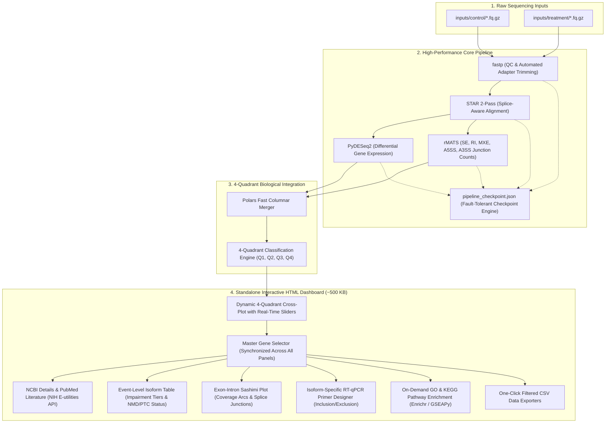

# GenSplice-Agent 🧬

> **Unified Transcriptomic Profiling & Alternative Splicing Visualization Platform with Standalone Interactive Reporting**

[](LICENSE)
[](https://www.python.org/downloads/)
[]()
[-brightgreen.svg)]()

`GenSplice-Agent` is an automated, high-throughput computational transcriptomics platform designed to bridge the gap between quantitative gene expression changes ($\text{Log}_2\text{FC}$, PyDESeq2) and qualitative post-transcriptional isoform variations ($\Delta\text{PSI}$, rMATS) within a unified 4-quadrant coordinate space.

It runs entirely locally with **zero server/cloud dependency**, auto-resumes interrupted runs via persistent checkpoints, and generates an ultra-lightweight, self-contained interactive HTML dashboard (`gensplice_report.html`) complete with exon-intron Sashimi plots, isoform-specific RT-qPCR primer design, and on-demand GO/KEGG pathway enrichment.

---

## 🧭 End-to-End Workflow Architecture



---

## 1. Overview & Conceptual Architecture (GenSplice 소개)

Conventional RNA-seq analysis pipelines disproportionately focus on total transcriptional abundance (Differential Expression Analysis, DEG), systematically overlooking critical regulatory events where total mRNA abundance remains unchanged while alternative exon skipping or inclusion triggers non-functional protein isoforms or Nonsense-Mediated Decay (NMD).

`GenSplice-Agent` resolves this limitation by projecting every gene onto a two-dimensional transcriptomic coordinate system:
- **X-axis**: Quantitative transcriptional abundance ($\text{Log}_2\text{FC}$) evaluated via negative-binomial generalized linear modeling (PyDESeq2).
- **Y-axis**: Qualitative isoform variation ($\Delta\text{PSI}$) determined via junction-centric splice counts (rMATS).

```text
                  ▲ ΔPSI (Alternative Splicing Index)
                  │
     [Q2] Splicing-Driven Only   │   [Q1] Dual Responders
   (Abundance Invariant, AS Switch)│ (Both Abundance and Isoform Altered)
   ★ Hidden Master Regulators ★   │
──────────────────┼──────────────────▶ Log2 Fold Change (Expression Abundance)
     [Q3] Invariant Background   │   [Q4] Expression-Driven Only
       (Homeostatic Baseline)     │  (Quantity Shift, Isoform Unchanged)
                  │
```

### The 4 Biological Quadrants
1. **Quadrant 1 (Q1 - Dual Responders)**: Significant changes in both transcriptional abundance ($|\text{Log}_2\text{FC}| \ge \text{Cutoff}$) and alternative splicing ($|\Delta\text{PSI}| \ge \text{Cutoff}$). Represents compound regulation where splicing amplifies or reshapes gene expression output.
2. **Quadrant 2 (Q2 - Splicing-Driven Targets)**: Significant alternative splicing alteration without significant change in total expression abundance. **These hidden regulators are entirely missed by standard DEG pipelines.**
3. **Quadrant 3 (Q3 - Invariant Background)**: Transcripts maintaining homeostatic baseline without significant expression or splicing variations. To optimize browser rendering performance and minimize HTML file size, Q3 points are excluded from the scatter plot traces while preserving total counts in summary metrics and data exports.
4. **Quadrant 4 (Q4 - DEG Only)**: Significant expression changes without detectable alterations in alternative splicing patterns.

---

## 2. Installation (install)

`GenSplice-Agent` provides an automated one-click installation script that establishes the complete Conda / Bioconda environment and checks all CLI binaries.

```bash
./install
```

### What `./install` Automatically Configures:
- **Bioinformatics CLI Engines**: `fastp` (read QC & trimming), `STAR` (splice-aware aligner), `rmats` (alternative splicing quantitation), `subread` (`featureCounts` read summarization), `R` (r-base runtime).
- **High-Performance Python Stack**: `polars` (fast columnar processing), `pydeseq2` (DESeq2 GLM modeling), `plotly` (interactive web graphics), `gseapy` (Enrichr API wrapper), `pandas`, `numpy`, `scipy`.
- **System Architecture Optimization**: Automatically detects hardware threads and available RAM, establishing memory-safe limits for STAR genome indexing and rMATS multithreading.

### System Verification & Testing
To confirm your installation works end-to-end on a benchmark dataset (GSE52778 human airway smooth muscle cells, Dexamethasone model) in under 60 seconds:
```bash
./test
```

---

## 3. Input Data Guidelines & Rules (input 넣기 및 법칙)

Place your raw sequencing FASTQ files into the `inputs/` directory divided into `control/` and `treatment/`:

```text
inputs/
├── control/
│   ├── control_rep1_1.fq.gz
│   ├── control_rep1_2.fq.gz
│   ├── control_rep2_1.fq.gz
│   └── control_rep2_2.fq.gz
└── treatment/
    ├── treat_rep1_1.fq.gz
    ├── treat_rep1_2.fq.gz
    ├── treat_rep2_1.fq.gz
    └── treat_rep2_2.fq.gz
```

### Naming Conventions & Rules
1. **Supported File Formats**:
   - Gzip-compressed FASTQ (strongly recommended): `.fq.gz`, `.fastq.gz`
   - Uncompressed FASTQ: `.fq`, `.fastq`
2. **Paired-End Suffix Conventions**:
   Read pairs are automatically recognized and matched using any standard convention:
   - Suffix format: `*_1.fq.gz` / `*_2.fq.gz` or `*_1.fastq.gz` / `*_2.fastq.gz`
   - Illumina format: `*_R1.fastq.gz` / `*_R2.fastq.gz` or `*_R1_001.fastq.gz` / `*_R2_001.fastq.gz`
3. **Single-End Support**:
   Single files without pair suffixes (e.g., `sampleA.fq.gz`) are automatically processed as single-end reads, and downstream STAR/rMATS flags automatically adapt.
4. **Data Integrity Verification**:
   The pipeline performs gzip block and EOF integrity validation before executing computationally heavy steps, preventing premature failures caused by corrupted downloads.

---

## 4. Reference Genome Setup (ref 다운로드)

Set up your organism's reference genome (FASTA sequence, GTF annotation, and pre-indexed STAR splice-junction database) with a single interactive command:

```bash
./ref
```

### Supported Organisms & Capabilities
Running `./ref` presents an interactive menu with automated download and indexing support across major research models:
- **Mammals**: Human (*Homo sapiens* GRCh38), Mouse (*Mus musculus* GRCm39), Rat, Pig, Cow, Dog, Macaque, Chimpanzee.
- **Model Animals & Birds**: Zebrafish (*Danio rerio*), Fruit Fly (*Drosophila melanogaster*), *C. elegans*, Xenopus, Chicken.
- **Crop Plants & Botany**: Rice (*Oryza sativa*), Arabidopsis (*Arabidopsis thaliana*), Maize (*Zea mays*), Wheat, Soybean, Tomato, Potato, Barley.
- **Fungi & Microorganisms**: Yeast (*Saccharomyces cerevisiae*), Fission Yeast (*Schizosaccharomyces pombe*).

*Note: `./ref` automatically downloads Ensembl/NCBI assemblies, validates coordinate checksums, and constructs the STAR splice-junction index using memory-safe thresholds.*

---

## 5. Pipeline Execution (GenSplice)

Launch the complete transcriptomics analysis pipeline with a single command:

```bash
./GenSplice
```

### Pipeline Execution Stages
1. **Step 1: Input Validation**: Scans `inputs/control` and `inputs/treatment`, validates file pairing, and performs gzip decompression integrity checks.
2. **Step 2: QC & Trimming (`fastp`)**: Automatically removes adapter sequences, filters low-quality bases (Q < 20), and auto-detects average read lengths for rMATS.
3. **Step 3: Genome Alignment (`STAR` 2-Pass)**: Executes splice-junction discovery and coordinate-sorted BAM generation with automated RAM limits.
4. **Step 4: Expression Quantification (`PyDESeq2`)**: Generates gene-level count matrices with featureCounts, performs size factor estimation, dispersion fitting, and Wald hypothesis testing.
5. **Step 5: Alternative Splicing Quantification (`rMATS`)**: Quantifies junction counts (JC) and junction-exon counts (JCEC) across all five canonical alternative splicing classes:
   - **SE**: Skipped Exon (Cassette Exon)
   - **RI**: Retained Intron
   - **MXE**: Mutually Exclusive Exons
   - **A5SS**: Alternative 5' Splice Site
   - **A3SS**: Alternative 3' Splice Site
6. **Step 6: Dashboard Compilation**: Integrates tables via Polars, designs isoform-specific RT-qPCR primers, pre-caches NCBI/PubMed records, and compiles the standalone interactive HTML report.

### Resilient Checkpoint Engine
Every step records state in `outputs/pipeline_checkpoint.json`. If a run is interrupted by hardware limits or system reboots, re-executing `./GenSplice` seamlessly resumes from the exact stage that was interrupted without recomputing expensive alignments.

---

## 6. Output Usage & Report Interpretation (결과물 사용법 및 해석)

All analysis results and reports are output directly into the `outputs/` directory:

```text
outputs/
├── 01_clean_fq/           # QC-filtered and trimmed FASTQ files
├── 02_aligned_bam/        # Coordinate-sorted BAM files and alignment logs
├── 03_deg/                # PyDESeq2 differential expression results (deg_result.csv)
├── 04_rmats/              # rMATS differential splicing matrices (SE, RI, MXE, A5SS, A3SS)
├── pipeline_checkpoint.json # Execution stage checkpoint ledger
├── pipeline_status.log    # Detailed pipeline execution timestamps and logs
└── gensplice_report.html  # [Final Dashboard] Standalone interactive HTML report (~500 KB)
```

### Standalone Interactive Dashboard (`gensplice_report.html`)
Open `outputs/gensplice_report.html` in any modern web browser (Chrome, Firefox, Safari, Edge). It requires **zero backend server or local Python environment** to interact with.

#### Key Dashboard Capabilities:
1. **🎛️ Real-Time 4-Quadrant Cross-Plot with Dynamic Sliders**:
   - Adjust $\text{Log}_2\text{FC}$ and $\Delta\text{PSI}$ cutoffs dynamically with responsive sliders.
   - Points automatically reclassify across Q1, Q2, and Q4 in real time on the Plotly canvas.
   - Dynamic threshold boxes highlight active quadrant boundary regions.
   - Background Q3 points are excluded from canvas traces to ensure high performance and sub-megabyte file size (~500 KB).
2. **🧬 Single Master Gene Selector (Synchronized Across 4 Panels)**:
   Selecting a gene symbol from the dropdown menu in the NCBI section instantly and synchronously updates all four downstream views:
   - **NCBI Gene Details & Literature**: Displays official gene names, genomic coordinates, functional summaries, and recent PubMed literature citations. Features automatic NIH NCBI E-utilities API live fetching for any un-cached target gene.
   - **Event-Level Isoform Annotations**: Detailed transcript table listing coordinates, $\Delta\text{PSI}$, $\text{Log}_2\text{FC}$, CDS reading frame shifts, Nonsense-Mediated Decay (NMD) / Premature Termination Codon (PTC) predictions, and functional impairment tier ratings.
   - **Visual Exon-Intron Structure & Sashimi Plot**: Interactive diagram illustrating upstream, alternative, and downstream exons alongside splice-junction read coverage counts for inclusion and exclusion isoforms.
   - **Isoform-Specific RT-qPCR Primer Designer**: Auto-designs forward and reverse primers spanning splice junctions specifically targeting both the inclusion isoform and the exclusion isoform, listing melting temperatures ($T_m$), GC content (%), and amplicon sizes for laboratory bench validation.
3. **🚀 On-Demand GO & KEGG Pathway Enrichment**:
   - Clean dashboard design: Enrichment cards remain hidden on initial load and appear instantly upon clicking **"🚀 Generate GO / KEGG"**.
   - Computes statistical significance ($- \log_{10}(\text{p-value})$, Adjusted P-value / FDR) for active Q1 + Q2 splicing targets via Enrichr / GSEAPy.
   - Dedicated CSV download buttons for biological processes and KEGG pathways.
4. **📥 Instant CSV Data Exports**:
   - **Download Filtered Gene List (.csv)**: Exports all active genes matching current threshold slider cutoffs.
   - **Download Filtered Isoforms (.csv)**: Exports full event-level isoform structural and impairment annotations.
   - **Download GO / KEGG Pathway (.csv)**: Exports functional pathway tables with gene overlap ratios and statistical p-values.

---

## 📄 Citation & References

If you use `GenSplice-Agent` in your research, please cite:

- **PyDESeq2**: Muzellec et al., *PyDESeq2: a python package for bulk RNA-seq differential expression analysis*, Bioinformatics, 2023.
- **rMATS**: Shen et al., *rMATS: Robust and flexible detection of differential alternative splicing from replicate RNA-Seq data*, PNAS, 2014.
- **STAR**: Dobin et al., *STAR: ultrafast universal RNA-seq aligner*, Bioinformatics, 2013.
- **fastp**: Chen et al., *fastp: an ultra-fast all-in-one FASTQ preprocessor*, Bioinformatics, 2018.

---

## ⚖️ License
Distributed under the MIT License. See [LICENSE](LICENSE) for details.
